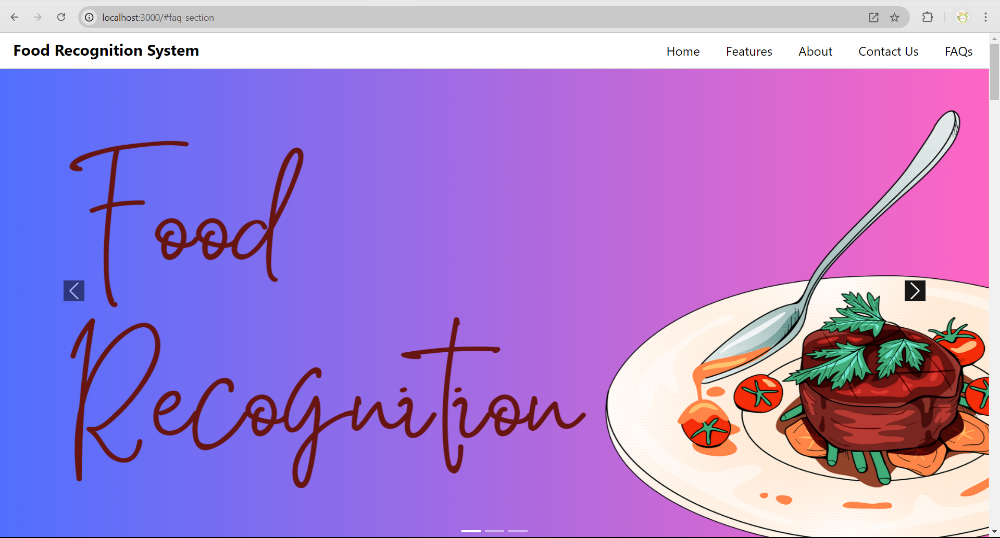
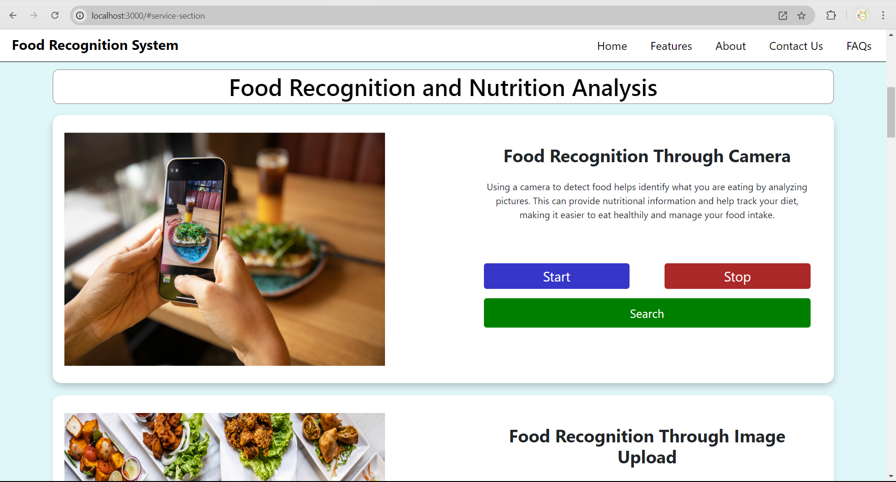
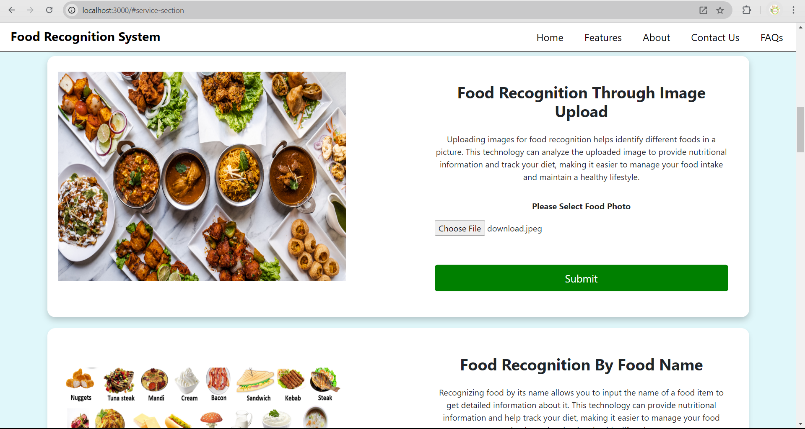
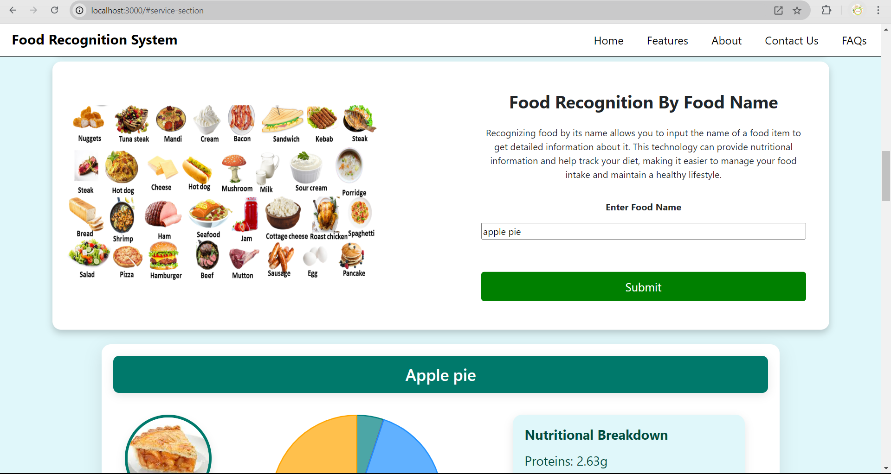
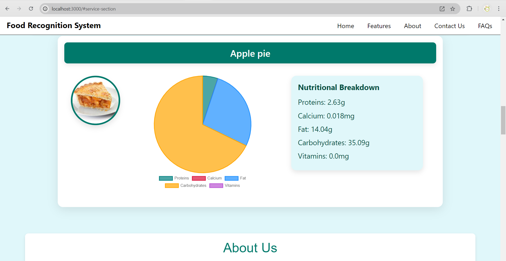
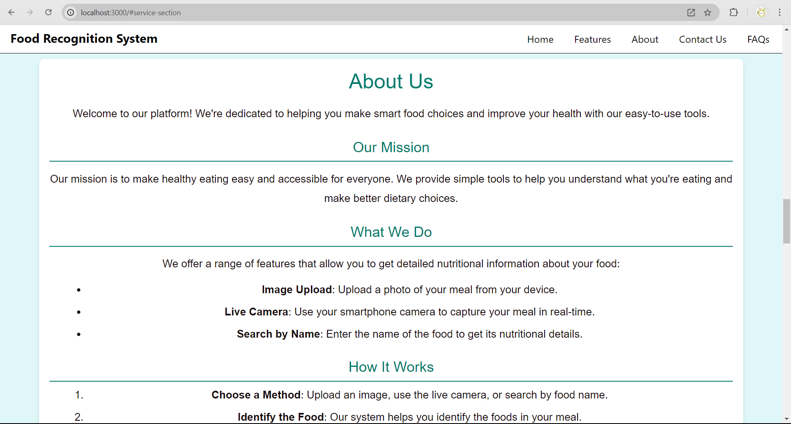
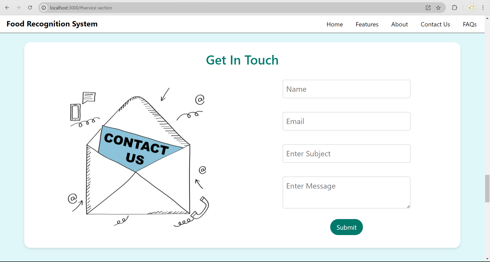
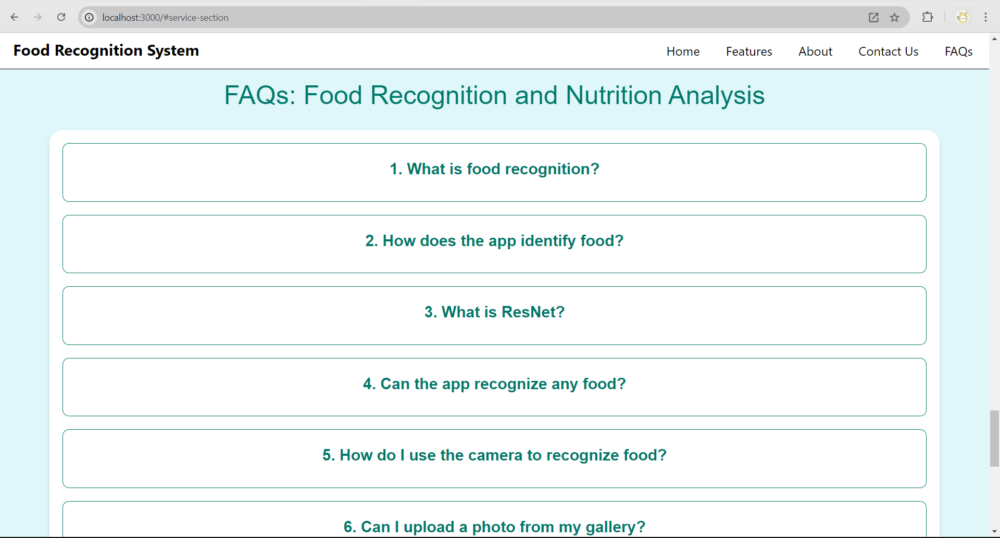

# Food Recognition Website

A deep learning-based web application designed to recognize food items and provide nutritional details like calories, vitamins, proteins and etc. The system supports real-time analysis through camera mode, food name search, and image upload functionality. It leverages advanced image recognition models for a seamless user experience.

## Features
- **Camera Mode**: Capture real-time images of food and get instant nutritional information.
- **Name-Based Mode**: Search food items by name to get nutritional details.
- **Image Upload Mode**: Upload images from your device for analysis.

## Interface

| Home Page | Search Food By Camera | Search Food By Image | Search Food By Name |
|-------------|-------------|---------------------|-----------------------|
|  |  |  |  |
## Interface

| Output Page | About Page | Contact Us Page | FAQ Page |
|-------------|-------------|---------------------|-----------------------|
|  |  |  |  |
  


## Technologies Used

- **Frontend:** React.js, Tailwind CSS, JavaScript
- **Backend:** Flask, Node.js, Express.js
- **Database:** MongoDB
- **Machine Learning:** TensorFlow, Keras, OpenCV
- **Languages:** Python, JavaScript
 
## Software Requriment:
- **Linux** (Ubuntu 18.04 or newer) or **Windows 10/11** (64-bit)
- **macOS** 10.15 or later
- **VsCode** (for writing code)
- **Python 3.7 or higher**
- **Node.js 14.x or higher**
- **MongoDB** (for database management)
- **Flask** (for backend API development)
- **React.js** (for frontend)
- **TensorFlow/Keras** (for deep learning model implementation)
- **OpenCV** (for image processing)
- **Postman** (for API testing)
 

## Installation and Setup

Follow these steps to set up the project on your local machine:

### 1. Clone the Repository

```bash
git clone https://github.com/your-repo/food-recognition-system.git
cd food-recognition-system
```

### 2. Install Dependencies

#### Node.js Libraries:

```bash
npm install
```

#### Python Libraries:

```bash
pip install flask
pip install fileread
pip install cors
```

#### React Libraries:

```bash
cd UI
npm install
```

### 3. Setup Database

- Create a MongoDB database.
- In the root directory, create a `.env` file and add the following:

```bash
PORT=5000
DATABASE_URL="add your database URL string here"
```

### 4. Start the Servers

#### Start Python Backend:

```bash
python app.py
```

#### Start Node.js Backend:

```bash
npm run dev
```

#### Start React Frontend:

```bash
cd UI
npm start
```

---
 
## Schemas
  - Contact Us Schema: Manages the data for user inquiries via the contact form.
  - Food Data Schema: Stores information about food items, including their nutritional content.
  - About Us Schema: Contains information about the platform, its purpose, and the team behind it. write in readme.md file forma


## Contact
For any inquiries or support, feel free to contact:
- **Name**: [Suraj Pandey]
- **Email**: [surajpandey7493@gmail.com]
- **GitHub**: [https://github.com/spsurajpandeysp](https://github.com/spsurajpandeysp)]
- **My Portfolio**: [https://surajpandey.vercel.app](https://surajpandey.vercel.app)]


🌟 **Thank You for Taking the Time to Explore Our Project!** 🌟
